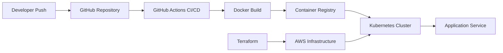

## Cloud DevOps Platform Architecture

```mermaid
flowchart LR
A[Developer Push] --> B[GitHub Repository]
B --> C[GitHub Actions CI/CD]
C --> D[Docker Build]
D --> E[Container Registry]
E --> F[Kubernetes Cluster]
G[Terraform] --> H[AWS Infrastructure]
H --> F
F --> I[Application Service]
```
